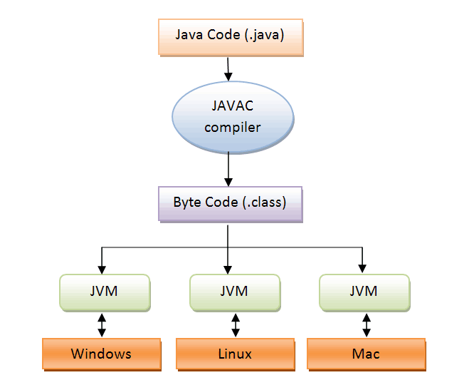
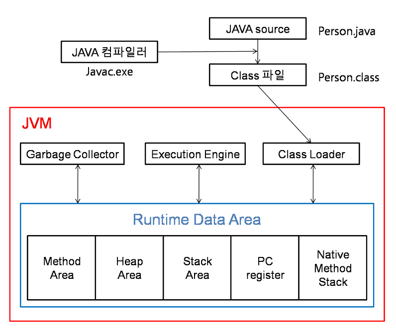
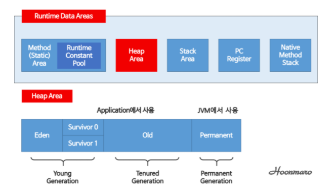

# [ JVM 메모리 구조 ]

JVM은 Java Virtual Machine의 약자로, 자바 가상 머신이라고 부릅니다.

그리고 자바와 운영체제 사이에서 중개자 역할을 수행하며, 자바가 운영체제에 구애받지 않고 프로그램을 실행할 수 있도록 도와줍니다.

자바 컴파일러에 의해 자바 소스 파일은 바이트 코드로 변환됩니다.

그리고 이러한 바이트 코드를 JVM에서 읽어 들인 다음에 실행하기 때문에 그림과 같이 Windows, Linux, Mac 같은 여러 운영체제에서 프로그램을 실행 할 수 있습니다.

자바를 실행하기 위해서는 JVM을 갖고있기만 하면 되고 운영체제에 대해선 독립적이라는 것을 알 수 있습니다.

JVM의 구성을 살펴보면 크게 4가지로 이루어져 있습니다.

- Class Loader
- Execution Engine
- Garbage Collector
- Runtime Data Area

## Class Loader

자바 소스를 자바 컴파일러가 컴파일하면  Person.class 같은 바이트코드가 생성된다. 이렇게 생성된 클래스파일들을 엮어서 JVM이 운영체제로부터 할당받은 메모리 영역인 Runtime Data Area로 적재하는 역할을 Class Loader가 한다.

## Execution Engine

Class Loader에 의해 메모리에 적재된 클래스(바이트 코드)들을 기계어로 변경해 명령어 단위로 실행하는 역할을 한다.

명령어를 하나 하나 실행하는 인터프리터(Interpreter)방식이 있고 JIT(Just-In-Time) 컴파일러를 이용하는 방식이 있다.

JVM이 처음 나왔을 당시에는 인터프리터 방식이었는데 속도가 느리다는 단점이 있어 JIT 컴파일러 방식을 통해 이 점을 보완하였습니다.

## Garbage Collector

Garbage Collector(GC)는 heap 메모리 영역에 생성(적재)된 객체들 중에 참조되지 않은 객체들을 탐색 후 제거하는 역할을 한다.

## Runtime Data Area

JVM의 메모리 영역으로 자바 애플리케이션을 실행할 때 사용되는 데이터들을 적재하는 영역이다.

### Method (static) area

JVM이 읽어들인 클래스와 인터페이스에 대한 런타임 상수 풀, 멤버 변수(필드), 클래스 변수(Static 변수), 생성자와 메소드를 저장하는 공간이다.

### Runtime Constant Pool

- 메서드 영역에 포함되지만 독자적 중요성이 있다.
- 클래스파일 constant_pool 테이블에 해당하는 영역이다.
- 클래스와 인터페이스 상수, 메서드와 필드에 대한 모든 레퍼런스를 저장한다.
- JVM은 런타임 상수 풀을 통해 해당 메서드나 필드의 실제 메모리 상 주소를 찾아 참조한다.

> **참고**  
메서드 영역/ 런타임 상수 풀은 JVM 시작시 생성해 프로그램 종료시까지 사용된다. 즉 모든 스레드에서 공유되는 자원이다.

### Heap Area

- JVM이 관리하는 프로그램 상에서 데이터를 저장하기 위해 런타임시 동적으로 할당하여 사용하는 영역이다.
- new 연산자로 생성된 객체 또는 객체(인스턴스)와 배열을 저장한다.
- 힙 영역에 생성된 객체와 배열은 스택 영역의 변수나 다른 객체의 필드에서 참조한다.
- 참조하는 변수나 필드가 없다면 의미 없는 개체가 되어 GC의 대상이 된다.
- 모든 스레드에서 공유한다.

> **참고**  
객체가 선언되는 런타임시 할당되고 객체가 더이상 사용되지 않거나 명시적으로 null선언 시 할당이 끝난다.
할당이 끝나면 GC의 대상이 된다.

### Stack Area

- 각 스레드마다 하나씩 존재하며, 스레드가 시작될 때 할당된다.
- 메서드 호출할 때 마다 프레임(Frame)을 추가(push)하고 메서드가 종료되면 해당 프레임을 제거(pop)하는 동작을 수행한다.
- FILO(First In Last Out)구조로 push와 pop 기능 사용
- 메서드 정보, 지역변수, 매개변수, 연산 중 발생하는 임시 데이터 저장
- **원시 타입(primitive type) 변수는 스택 영역에 값을 저장한다.**
- **참조 타입(reference type) 변수는 힙 영역이나 메서드 영역의 객체 주소값을 가진다.**

### PC Register

- 현재 수행 중인 JVM 명령 주소를 갖는다.
- 프로그램 실행은 CPU에서 인스트럭션을 수행
- CPU는 인스터럭션을 수행하는 동안 필요한 정보를 CPU 내 기억장치인 레지스터에 저장한다.
- 연산 결과값을 메모리에 전달하기 전 저장하는 CPU 내의 기억장치

### Native Method Stack Area

- 자바 외 언어로 작성된 네이티브 코드를 위한 Stack이다.
- JNI(Java Native Interface)를 통해 호출되는  C/C++ 등의 코드를 수행하기 위한 스택이다.
- 네이티브 메서드의 매개변수, 지역변수 등을 바이트 코드로 저장한다.