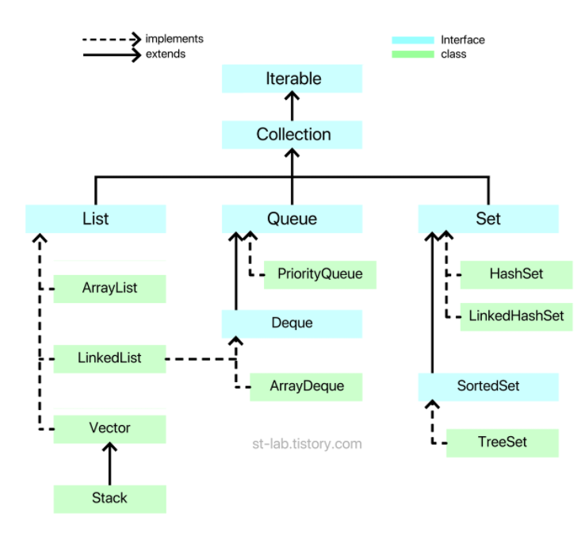

자료구조 분류법은 많은 분류법이 있지만, 대표적으로 많이 분류되는 방법은 **선형 자료구조(Linear Data Structure)**과 **빈선형 자료구조(Nonlinear Data Structure)**로 나눌 수도 있다. 이러한 분류를 보통 **'형태에 따른 자료구조'**라고 본다.

 

**선형 자료구조(Linear Data Structure)**

- 데이터가 일렬로 연결된 형태
- 우리가 흔히 쓰는 int[] 배열 같은 것이다.
- 선형 자료구조는 대표적으로 **리스트(List)**와 **큐(Queue)**, **덱(Deque)**이 있다.

 

**비선형 자료구조(Nonlinear Data Structure)**

- 일렬로 나열된 것이 아닌, 각 요소가 여러 개의 요소와 연결된 형태
- 대표적인 비선형 자료구조는 **그래프(Graph)**와 **트리(Tree)**가 있다.

 
위 두 가지 분류에 해당되지 않는 자료구조가 있는데 **집합(Set)**이 있다. 보통 기타 자료구조 or 집합 자료구조로 본다. 집합의 경우는 데이터가 연결 된 형식이 아니다.

  

# Java Collections FrameWork

자료구조를 공부하다 보면 Java Collections FrameWork라는 단어를 많이 만나게 될것이다.

쉽게 말하면 일정 타입의 데이터들이 모여 쉽게 가공 할 수 있도록 자료구조들의 뼈대라는 의미이다.

자바에서 제공하는 Collection은 크게 3가지 인터페이스로 나뉘어있다. 크게 List(리스트), Queue(큐), Set(집합)으로 나뉘어 있다.

점선은 구현 관계이고, 실선은 확장 관계다. (인터페이스끼리는 다중 상속이 가능하다) 또한 Collection을 구현한 클래스 및 인터페이스들은 모두 java.util 패키지에 있다.

List, Queue, Set이 3가지의 형태에 따른 자료구조들이 있다. 그리고 Queue와 Set에는 조금 더 구체화 되어 Deque와 SortedSet이라는 형태에 따른 자료구조가 있다. 그리고 이 형태에 따른 자료구조들은 각각 '구현'이 되어 class로 제공된다. 녹색 부분이 '구현된 자료구조'라고 보면 된다. 자바에서 interface를 class파일에서 쓰면 보통 '구현한다'라고 한다.

그럼 한가지 의문이 드는것이 있다. Iterable은 뭘까 싶다. Iterable은 반복가능한 for-each를 제공한다. Iterable이 없다면 자료구조의 있는 데이터들을 모두 순회하면서 출력하려면 사용자가 각각의 데이터 순회 방법을 알거나 하나씩 get() 같은 메서드를 통해 데이터를 꺼내야 한다. 하지만 Iterable에서 for-each를 제공해주기 때문에 쉽게 반복을 사용할 수 있다.

  

# List(리스트)

List Interface(리스트 인터페이스)는 대표적인 선형 자료구조로 주로 순서가 있는 데이터를 목록으로 이용할 수 있도록 만들어진 인터페이스다. 우리가 많이 사용하던 `int[] array = new int[10];` 는 선언한 10개의 공간 외에는 더이상 사용하지 못한다. 할당된 크기를 벗어나면 IndexOutofBoundsException 라는 에러가 발생한다.

이러한 단점을 보완하여 List를 통해 구현된 클래스들은 '동적 크기'를 갖으며 배열처럼 사용할 수 있게 되어있다.

**<List Interface를 구현하는 클래스>**

1. ArrayList
2. LinkedLisst
3. Vector
4. Stack

 

### ArrayList

ArrayList는 Object[] 배열을 사용하면서 내부 구현을 통해 동적으로 관리를 한다. 우리가 흔히 쓰는 primitive 배열과 유사한 형태라고 보면 된다. 따라서 요소 접근(access elements)에서는 탁월한 성능을 보이나, 중간의 요소가 삽입, 삭제가 일어나는 경우 그 뒤의 요소들은 한 칸씩 밀어야 하거나 당겨야 하기 때문에 삽입, 삭제에서는 비효율적인 모습을 보인다.

 

### LinkedList

LinkedList는 데이터(item)와 주소로 이루어진 클래스를 만들어 서로 연결하는 방식이다. 데이터와 주소로 이루어진 클래스를 Node라고 하는데, 각 노드는 이전의 노드와 다음 노드를 연결하는 방식인 것이다. 즉, 객체끼리 연결한 방식이다. 그래서 요소를 검색해야 할 경우 순차방문을 통해 검색해야 하므로 성능이 떨어지나, 해당 노드를 삭제, 삽입해야 할 경우 해당 노드의 링크를 끊거나 연결만 해주면 되기 때문에 삽입, 삭제에서는 매우 좋은 효율을 보인다.

 

### Vector

기본적으로 ArrayList와 거의 같다. 대신 Vector의 경우 항상 '동기화'를 지원한다. 그래서 멀티 쓰레드에서는 안전하지만, 단일 쓰레드에서도 동기화를 하기 때문에 ArrayList에 비해 성능이 약간 느리다.

 

### Stack

Stack은 LIFO(Last in First out) 후입선출이라고 한다. 가장 늦게 들어오게 제일 먼저 나가는 것이다. 

참고로 Stack의 경우 Vector클래스를 상속받고 있고, java에서 지원하는 Stack 클래스의 메소드들도 뜯어보면 알겠지만, 모두 Vector에 있는 메소드를 이용하여 구현되고 있어 크게 다를 것은 없다.

  

# Queue(큐)

Queue Interface는 선형 자료구조로 주로 순서가 있는 데이터를 기반으로 FIFO(First In First Out)을 위해 만들어진 인터페이스다. Queue를 상속하고 있는 Deque(덱)이라는 Interface도 있다. Queue는 한쪽 방향으로만(단방향) 삽입 삭제가 가능한 반면, Deque는 Double ended Queue라는 의미로 양쪽에서 삽입삭제가 가능한 자료구조라 보면 된다. 

**<Queue/Deque Interface를 구현하는 클래스>**

1. LinkedList
2. ArrayDeque
3. PriorityQueue

여기서 LinkedList가 또 나와? 싶을 것 같다. 그림을 보면 알겠지만 LinkedList는 List(리스트)를 구현하기도 하지만, Deque(덱)도 구현한다.

즉, LinkedList는 사실상 3가지 용도로 쓸 수 있다.

1. List
2. Deque
3. Queue

왜 LinkedList를 받을까? 앞서, List를 설명할 때도 말했지만, ArrayList와 LinkedList의 차이점은 Object[] 배열로 관리하느냐, Node라는 객체를 연결하여 관리하느냐의 차이였다.

마찬가지다. **Deque 또는 Queue를 LinkedList 처럼 Node 객체로 연결해서 관리하길 원한다면 LinkedList를 쓰면 된다.** 반대로 ArrayList처럼 Object[] 배열로 구현되어 있는 것은 ArrayDeque이다. 

 

### PriorityQueue

'우선선위 큐'다. LinkedList는 Queue로 사용할 수 있다고 했다. 다만 큐의 원리가 선입선출이라는 전제 아래 짜여있다. 하지만 PriorityQueue는 '데이터 우선순위'에 기반하여 우선순위가 높은 데이터가 먼저 나오는 원리다. 따로 정렬방식을 지정하지 않는다면 **낮은 숫자가 높은 우선순위를 갖는다**. PriorityQueue는 주어진 데이터들 중 최댓값, 혹은 최솟값을 꺼내올 때 매우 유용하게 사용될 수 있다. 다만 **사용자가 정의한 객체를 타입으로 쓸 경우 반드시 Comparator 또는 Comparable을 통해 정렬 방식을 구현해주어야 한다**. 

  

# Set(셋)

Set(세트)는 말 그대로 '집합'이다. Set의 가장 큰 특징이라 하면 크게 두 가지가 있다. 첫번째로 '**데이터를 중복해서 저장할 수 없음**' 두번째는 '**입력 순서대로의 저장 순서를 보장하지 않는다**'이다.

(다만 LinkedHashSet은 Set임에도 불구하고 입력 순서대로의 저장순서를 보장한다.)

**<Set/SortedSet Interface를 구현하는 클래스>**

1. HashSet
2. LinkedHashSet
3. TreeSet

### HashSet

가장 기본적인 Set 컬렉션의 클래스이다. 입력 순서를 보장하지 않고, 순서도 마찬가지로 보장되지 않는다. 가장 쉽게 이해할 수 있는 예로는 여러분이 게임에서 '닉네임'을 만든다거나 아이디를 생성할 때 '중복확인'을 눌러 중복된 닉네임 또는 아이디인지 확인하는 것이다. 이는 데이터가 정렬되어있을 필요도 없고, 빠르게 중복되는 값이지만 찾으면 되기 때문에 유용한 방법이 될 수 있다.

또한 hash에 의해 데이터의 위치를 특정시켜 해당 데이터를 빠르게 색인(search)할 수 있게 만든 것이다. 즉, Hash 기능과 Set컬렉션이 합쳐진 것이 HashSet이다. 그렇기 때문에 삽입, 삭제, 색인이 매우 빠른 컬렉션 중 하나다.

 

### LinkedHashSet

Link + Hash + Set 이 결합된 형태다. LinkedList에서 보면 add() 메서드를 통해 요소들을 넣은 순서대로 연결한다. Set의 경우 기본적으로 입력 순서대로의 저장순서를 보장하지 않아 이를 보완하기 위해 존재하는 것이 바로 LinkedHashSet이다. 

 

### TreeSet

TreeSet은 HashSet과 거의 유사하다. 다만 특별한 점이 있다면 SortedSet Interface의 이름을 보면 알 수 있듯 '가중치에 따른 순서'대로 정렬을 보장한다. 앞서 PriorityQueue와 비슷하다. 주로 '중복되지 않으면서 특정 규칙에 의해 정렬된 형태의 집합'을 쓰고 싶을 때 쓴다. 정렬된 형태로 있다보니 특정 구간의 집합요소들을 탐색할 때 매우 유용하다.

 

참고자료 : https://st-lab.tistory.com/142?category=856997