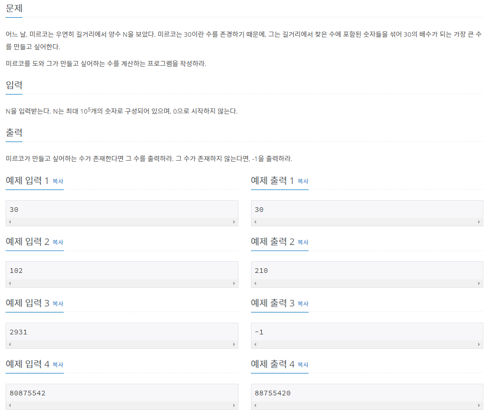

# 문제
)  
<br>

# 문제 풀이
<br>

이 문제의 핵심은 주어진 양수 N이 30의 배수가 되는지 안되는지 판별하는것이다.  
30 = 3 * 10 으로 3의배수 이면서 10의 배수인 조건을 만족하면 된다.  
<br>
1. 10의 배수 : 양수 N에 0이라는 숫자가 들어있다면 숫자 맨끝에 0을 위치시켜 예)xxxx0 , 1910 , 2240  조건을 만족시킬 수 있다.
2. 3의 배수 : 3의 배수는 모든 숫자의 합이 3의 배수이면 그 수는 3의 배수이다.  
   예) 12345 라는 숫자가 있다면 1+2+3+4+5 = 15이고 15는 3의 배수이므로 12345라는 수는 3의배수를 만족한다.

<br>

## 주의사항
이 문제의 조건에서 양수 N은 10^5의 숫자로 이루어 질 수 있다고 했다. 즉 int 나 long 타입으로는 문제를 풀수없다.
그래서 **String 타입**으로 입력받고 크기가 10인 배열을 생성해 숫자들의 갯수를 저장해줄것이다.  
<br>

예) 80875542 숫자가 있다면  
배열에 이와 같이 값이 저장될 것이다.  

0|1|2|3|4|5|6|7|8|9
---|---|---|---|---|---|---|---|---|---
1|0|1|0|1|2|0|1|2|0
<br>

이렇게 배열로 저장해두면  
1. 숫자 0의 포함 여부를 쉽게 판단할 수 있다.
2. 모든 숫자의 합을 구하기 쉽다.
3. 문제에서 가장 큰수를 구하라 했으므로, 숫자 9부터 존재하는 갯수만큼씩 나열해주면 된다.
<br>

이런 장점들이 있다.  
<br>

# Code
```Java
import java.io.BufferedReader;
import java.io.IOException;
import java.io.InputStreamReader;

public class Main {
    public static void main(String[] args) throws IOException {
        BufferedReader br = new BufferedReader(new InputStreamReader(System.in));
        String str = br.readLine();
        int[] digitCount = new int[10];

        for (int i = 0; i < str.length(); i++) {
            char ch = str.charAt(i);
            digitCount[ch - '0']++;
        }

        StringBuilder sb = new StringBuilder();

        // 30의 배수를 생성할 수 있는지 판별
        if (!check(digitCount)) {
            sb.append("-1");
        } else {
            sb = createDigit(digitCount);
        }

        System.out.println(sb.toString());
    }

    // 가장 큰 수를 생성
    private static StringBuilder createDigit(int[] digitCount) {
        StringBuilder sb = new StringBuilder();

        for (int i = 9; i >= 0; i--) {

            while (digitCount[i]-- > 0) {
                sb.append(i);
            }
        }

        return sb;
    }

    // 30의 배수를 만들 수 있는지 판별
    private static boolean check(int[] digitCount) {

        if (digitCount[0] == 0) {
            return false;
        }

        int sum = 0;
        for (int i = 1; i <= 9; i++) {
            sum += digitCount[i] * i;
        }

        if (sum % 3 == 0) {
            return true;
        }

        return false;
    }
}
```
<br><br>

