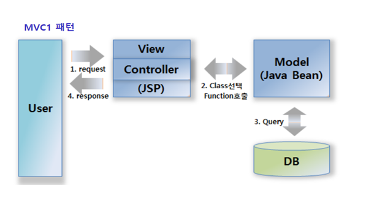
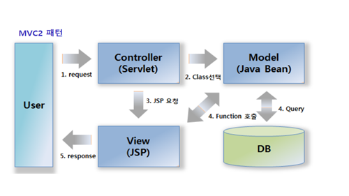

MVC1 패턴과 MVC2 패턴의 차이점을 알아보겠습니다.  
 

# MVC 패턴
MVC 패턴 이전에는 크게 비즈니스로직과 뷰로직 두가지로 나뉘어 개발을 하였습니다.  
 

그러나 JSP만으로 비즈니스 로직과 뷰 렌더링까지 모두 처리하게 되면서, JSP에 너무 많은 역할이 할당되었고 유지보수 측면에도 많은 어려움을 겪게되었습니다.  
 

**MVC**
* Controller : HTTP 요청을 받아서 비즈니스 로직을 처리한다.
* Model : 컨트롤러에서 뷰로 전달할 데이터를 넘겨 받아 뷰에게 전달해 준다.
* View : 모델에 담겨있는 데이터를 이용해 화면을 출력해준다.
  

# MVC 1

MVC1 패턴은 View와 Controller를 모두 JSP가 담당하는 형태입니다.  
 

JSP로 클라이언트의 요청 및 응답을 모두 처리합니다.  
당연히 JSP 역할이 너무 많아 재사용성도 떨어지고 유지보수도 어려워 집니다.  
 

# MVC 2

MVC1과는 다르게 Controller와 View가 분리되어 있습니다.
역할이 분리되어 유지보수 측면에서도 많은 이점을 가집니다.
  

JSP를 뺀 로직 측면으로는 본다면  
MVC1 패턴은 Controller에서 모든 비즈니스 로직을 다 처리한다면  
MVC2 패턴은 Controller는 컨트롤러의 역할  
* HTTP요청에 따라 필요한 비즈니스 로직을 연결해주고 비즈니스 로직을 통해 나온 데이터를 적절한 View에 갖다주는 맵핑 역할  

 
비즈니스 로직은 Service단에서 처리합니다.

